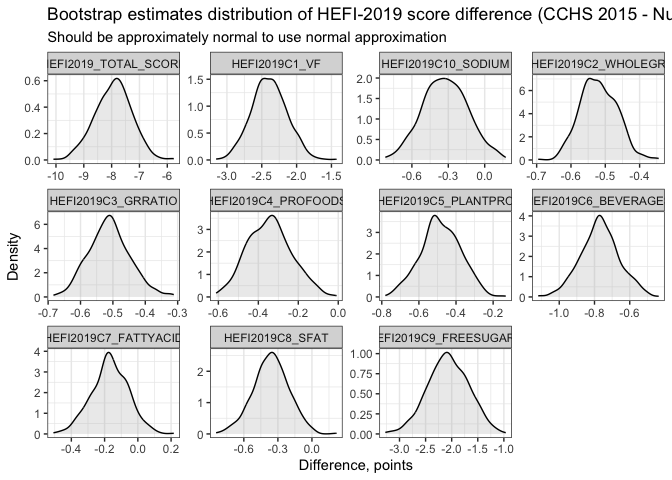

Descriptive statistics based on a single 24-h recall: mean HEFI-2019
scores
================
Didier Brassard
2022-12-17

``` r
# *********************************************************************** #
#                                                                         #
#                      CCHS 2015 - Nutrition (PUMF)                       #
#                                                                         #
#          Descriptive statistics based on a single 24-h recall           #
#                                                                         #
#                        Author: Didier Brassard                          #
#                                                                         #
#                               Version 1                                 #
#                               2022-12-15                                #
#                                                                         #
# NOTE: This code assumes that <01_CCHS2015_Data_preparation.r            #
# was executed beforehand.                                                #
#                                                                         #
# *********************************************************************** #

# *********************************************************************** #
#                                                                         #
#                   General set-up: location of files                     #
#                                                                         #
# *********************************************************************** #

# Note 1: a hard coded path (<external_drive>) is used since files are on an external drive.
# Usually we would want analysis to be self-contained, but survey files are a bit large.
# Also, the data are set up exactly as they are once obtained from Statistics Canada

# Note 2: data pertaining to the 2015 Canadian Community Health Survey -
# Nutrition (Public Use Microdata Files) are available upon request to
# Statistics Canada online: https://www150.statcan.gc.ca/n1/en/catalogue/82M0024X2018001

# TO DO: Update CCHS 2015 - Nutrition file location
external_drive <- file.path("","Volumes","SANDISK DID")

  ## Automatic: create shortcuts for raw CCHS 2015 - Nutrition file location
  cchs_dir <- file.path(external_drive,"CCHS_Nutrition_2015_PUMF","Data_Donnee")
  boot_dir <- file.path(external_drive,"CCHS_Nutrition_2015_PUMF","Bootstrap","Data_Donnee")

# TO DO: define current directory (cd)

  ## For R script execution (full repository):
  cd <- file.path(".","Example_R_cchs")
  sas_dir <- file.path(".","Example_SAS_cchs")

  ## For Markdown execution (self-contained):
  cd <- '.'
  sas_dir <- cd

# Automatic: create shortcuts for project directory tree

  ## Common directory
  data_dir <- file.path(cd, "Fmtdata")
  temp_dir <- file.path(cd, "Temp")

# Packages
  library(data.table)
  library(haven)
  library(tidyverse)
  library(tidylog)
  library(gtsummary)
  library(gt)
  library(parallel)
  library(furrr)
  library(purrr)
  library(tictoc)

# HEFI-2019 scoring algorithm
  #if not installed: devtools::install_github("didierbrassard/hefi2019")
  library(hefi2019)

# suppress scientific notation
  options(scipen = 9999)


# *********************************************************************** #
#                                                                         #
#         Estimate mean scores using the population ratio method          #
#                      (First 24-h dietary recall)                        #
#                                                                         #
# *********************************************************************** #

  # note: the population ratio method is preferable to derive mean HEFI-2019 scores
  # when using data from a single 24-h dietary recall.
  # reference: Freedman et al. J Nutr (2008) https://pubmed.ncbi.nlm.nih.gov/18716176/

# Load processed data
  load(file.path(data_dir,"intake_per24hr.rdata"))
  load(file.path(data_dir,"hs_nci.rdata"))

# 1) Combine dietary intakes of the first recall with sociodemo data

  intake_and_sociodeom <-
    inner_join(intake_per24hr,hs_nci|>select(ADM_RNO,SUPPID,WTS_P,drig,sex,age,smoking)) |>
    # remove 24-h recall with 0 energy intake & first 24-hr only
    filter(energy>0 & SUPPID==1)
```

    ## Joining, by = c("ADM_RNO", "SUPPID")
    ## inner_join: added 5 columns (WTS_P, drig, sex, age, smoking)
    ## > rows only in x ( 0)
    ## > rows only in y ( 0)
    ## > matched rows 27,544
    ## > ========
    ## > rows total 27,544
    ## filter: removed 7,441 rows (27%), 20,103 rows remaining

``` r
  #note: sample size of respondents 2y+ for first 24-h recall = 20,103

# 2) Calculate HEFI-2019 scores based on mean intakes

  # note: sampling weights are applied, but variance ignored for this example

  # 2.1) define vectors of HEFI-2019 dietary constituents
  hefi2019_vars <- names(intake_per24hr[,3:(ncol(intake_per24hr)-1)])
  hefi2019_vars
```

    ##  [1] "wg"         "rg"         "pfab"       "pfpb"       "otherfoods" "vf"         "water"      "otherbevs" 
    ##  [9] "milk"       "plantbev"   "freesugars" "energy"     "sfa"        "mufa"       "pufa"       "sodium"

``` r
  # 2.2) Calculate mean intakes of HEFI-2019 dietary constituents, weighted using sampling weights
  popratio_scored <-
    intake_and_sociodeom |>
    summarise(
      across(all_of(hefi2019_vars), function(x) weighted.mean(x,WTS_P), .names ="{col}_MEAN")
      # note: suffix <_MEAN> added for labeling population-level values (vs. respondent-level)
    ) |>
  # 2.3) Apply the HEFI-2019 scoring algorithm
    hefi2019(#indata             = .,
             vegfruits          = vf_MEAN,
             wholegrfoods       = wg_MEAN,
             nonwholegrfoods    = rg_MEAN,
             profoodsanimal     = pfab_MEAN,
             profoodsplant      = pfpb_MEAN,
             otherfoods         = otherfoods_MEAN,
             waterhealthybev    = water_MEAN,
             unsweetmilk        = milk_MEAN,
             unsweetplantbevpro = plantbev_MEAN,
             otherbeverages     = otherbevs_MEAN ,
             mufat              = mufa_MEAN ,
             pufat              = pufa_MEAN ,
             satfat             = sfa_MEAN ,
             freesugars         = freesugars_MEAN,
             sodium             = sodium_MEAN,
             energy             = energy_MEAN
    ) |>
    mutate(drig=0)
```

    ## Healthy Eating Food Index-2019 Scoring Algorithm R version 1.2
    ## summarise: now one row and 16 columns, ungrouped

``` r
  # 2.4) Repeat for DRI groups

  popratio_scored_drig <-
    intake_and_sociodeom |>
    group_by(drig) |>
    summarise(
      across(all_of(hefi2019_vars), function(x) weighted.mean(x,WTS_P), .names ="{col}_MEAN")
      # note: suffix <_MEAN> added for labeling population-level values (vs. respondent-level)
    ) |>
    # Apply the HEFI-2019 socring algorithm
    hefi2019(#indata             = .,
      vegfruits          = vf_MEAN,
      wholegrfoods       = wg_MEAN,
      nonwholegrfoods    = rg_MEAN,
      profoodsanimal     = pfab_MEAN,
      profoodsplant      = pfpb_MEAN,
      otherfoods         = otherfoods_MEAN,
      waterhealthybev    = water_MEAN,
      unsweetmilk        = milk_MEAN,
      unsweetplantbevpro = plantbev_MEAN,
      otherbeverages     = otherbevs_MEAN ,
      mufat              = mufa_MEAN ,
      pufat              = pufa_MEAN ,
      satfat             = sfa_MEAN ,
      freesugars         = freesugars_MEAN,
      sodium             = sodium_MEAN,
      energy             = energy_MEAN
    )
```

    ## Healthy Eating Food Index-2019 Scoring Algorithm R version 1.2
    ## group_by: one grouping variable (drig)
    ## summarise: now 14 rows and 17 columns, ungrouped

``` r
  #2.5) Combine the overall population estimates with subgroup estimates

  popratio_scored_all <-
      rbind(popratio_scored,popratio_scored_drig) |>
      select(drig,starts_with("HEFI"))

    # add labels to DRI groups
    popratio_scored_all$drig_f <-
      factor(popratio_scored_all$drig,
             levels = c(0,seq(2,15)),
             labels = c(
               'All, 2y or older',
               '2 to 3 y',
               '4 to 8 y',
               'Male, 9 to 13 y',
               'Female, 9 to 13 y',
               'Male, 14 to 18 y',
               'Female, 14 to 18 y',
               'Male, 19 to 30 y',
               'Female, 19 to 30 y',
               'Male, 31 to 50 y',
               'Female, 31 to 50 y',
               'Male, 51 to 70 y',
               'Female, 51 to 70 y',
               'Male, 71 y or older',
               'Female, 71 y or older'
             )
      )

# 3) Show results of mean score

  popratio_scored_all |>
    select(drig_f,starts_with("HEFI")) |>
    #pivot_longer(cols=starts_with("HEFI")) |>
    knitr::kable(digits=1,
                 caption = "Mean HEFI-2019 score among Canadians 2y+ (CCHS 2015 - Nutrition)")
```

| drig_f                | HEFI2019C1_VF | HEFI2019C2_WHOLEGR | HEFI2019C3_GRRATIO | HEFI2019C4_PROFOODS | HEFI2019C5_PLANTPRO | HEFI2019C6_BEVERAGES | HEFI2019C7_FATTYACID | HEFI2019C8_SFAT | HEFI2019C9_FREESUGARS | HEFI2019C10_SODIUM | HEFI2019_TOTAL_SCORE |
|:----------------------|--------------:|-------------------:|-------------------:|--------------------:|--------------------:|---------------------:|---------------------:|----------------:|----------------------:|-------------------:|---------------------:|
| All, 2y or older      |           9.5 |                1.2 |                1.4 |                 5.0 |                 1.6 |                  7.7 |                  2.2 |             4.0 |                   7.9 |                5.0 |                 45.5 |
| 2 to 3 y              |          10.3 |                1.1 |                1.3 |                 5.0 |                 1.0 |                  8.1 |                  0.9 |             2.6 |                   7.5 |                6.6 |                 44.3 |
| 4 to 8 y              |           9.0 |                1.3 |                1.2 |                 5.0 |                 1.2 |                  7.3 |                  1.3 |             3.9 |                   4.5 |                5.6 |                 40.3 |
| Male, 9 to 13 y       |           7.5 |                1.4 |                1.3 |                 5.0 |                 0.9 |                  7.2 |                  1.5 |             3.6 |                   4.5 |                5.0 |                 37.9 |
| Female, 9 to 13 y     |           8.5 |                1.2 |                1.1 |                 4.7 |                 0.7 |                  7.1 |                  1.3 |             3.6 |                   4.2 |                5.5 |                 38.0 |
| Male, 14 to 18 y      |           7.3 |                1.3 |                1.3 |                 5.0 |                 1.3 |                  6.9 |                  2.0 |             3.9 |                   5.0 |                5.0 |                 39.1 |
| Female, 14 to 18 y    |           8.4 |                1.2 |                1.3 |                 4.9 |                 1.3 |                  7.7 |                  1.6 |             3.2 |                   4.6 |                5.3 |                 39.7 |
| Male, 19 to 30 y      |           7.0 |                1.0 |                1.2 |                 5.0 |                 1.5 |                  7.0 |                  2.3 |             3.8 |                   7.3 |                4.8 |                 40.9 |
| Female, 19 to 30 y    |           9.5 |                1.0 |                1.3 |                 4.9 |                 1.2 |                  7.9 |                  2.1 |             4.1 |                   7.2 |                5.1 |                 44.2 |
| Male, 31 to 50 y      |           8.7 |                1.1 |                1.3 |                 5.0 |                 1.8 |                  7.3 |                  2.4 |             4.2 |                   8.4 |                4.9 |                 45.3 |
| Female, 31 to 50 y    |          10.7 |                1.1 |                1.4 |                 5.0 |                 1.9 |                  8.3 |                  2.3 |             3.9 |                   9.2 |                4.8 |                 48.6 |
| Male, 51 to 70 y      |           9.5 |                1.2 |                1.5 |                 4.9 |                 1.7 |                  7.4 |                  2.6 |             4.3 |                   9.6 |                4.9 |                 47.6 |
| Female, 51 to 70 y    |          11.5 |                1.2 |                1.7 |                 4.8 |                 1.8 |                  8.4 |                  2.3 |             4.3 |                   8.9 |                5.5 |                 50.4 |
| Male, 71 y or older   |          10.6 |                1.2 |                1.5 |                 4.4 |                 1.4 |                  7.6 |                  2.1 |             3.9 |                   8.7 |                4.8 |                 46.3 |
| Female, 71 y or older |          11.2 |                1.5 |                1.7 |                 4.6 |                 1.4 |                  8.4 |                  1.9 |             3.9 |                   8.2 |                4.7 |                 47.5 |

Mean HEFI-2019 score among Canadians 2y+ (CCHS 2015 - Nutrition)

``` r
# *********************************************************************** #
#                                                                         #
#                  Estimate mean scores and differences                   #
#                                                                         #
# *********************************************************************** #

  # note: we can calculate mean HEFI-2019 score difference using the same method
  # For this example, mean score difference among smokers vs. non-smokers

  # Load processed data
  load(file.path(data_dir,"intake_per24hr.rdata"))
  load(file.path(data_dir,"hs_nci.rdata"))

# 1) Combine dietary intakes of the first recall with sociodemo data

  intake_and_sociodeom <-
    inner_join(intake_per24hr,hs_nci|>select(ADM_RNO,SUPPID,WTS_P,drig,sex,age,smoking)) |>
    # remove 24-h recall with 0 energy intake & first 24-hr only & aged 19 y +
    filter(energy>0 & SUPPID==1 & age>=19) |>
    mutate(
      # recode smoking as yes or no
      smoking = ifelse(smoking %in% c(1,2),1,smoking)
    )
```

    ## Joining, by = c("ADM_RNO", "SUPPID")
    ## inner_join: added 5 columns (WTS_P, drig, sex, age, smoking)
    ## > rows only in x ( 0)
    ## > rows only in y ( 0)
    ## > matched rows 27,544
    ## > ========
    ## > rows total 27,544
    ## filter: removed 13,636 rows (50%), 13,908 rows remaining

``` r
# 2) Calculate mean intakes of HEFI-2019 dietary constituents, weighted using sampling weights

  # note: sampling weights are applied, but variance ignored for this example

  # 2.1) define vectors of HEFI-2019 dietary constituents
  hefi2019_vars <- names(intake_per24hr[,3:(ncol(intake_per24hr)-1)])
  hefi2019_vars
```

    ##  [1] "wg"         "rg"         "pfab"       "pfpb"       "otherfoods" "vf"         "water"      "otherbevs" 
    ##  [9] "milk"       "plantbev"   "freesugars" "energy"     "sfa"        "mufa"       "pufa"       "sodium"

``` r
  # 2.2) Calculate mean intakes of HEFI-2019 dietary constituents, weighted using sampling weights, by smoking
  popratio_scored_smk <-
    intake_and_sociodeom |>
    # remove 29 respondents with missing smoking status
    filter(is.na(smoking)==FALSE) |>
    group_by(smoking) |>
    summarise(
      across(all_of(hefi2019_vars), function(x) weighted.mean(x,WTS_P), .names ="{col}_MEAN")
      # note: suffix <_MEAN> added for labeling population-level values (vs. respondent-level)
    ) |>
    # Apply the HEFI-2019 scoring algorithm
    hefi2019(#indata             = .,
      vegfruits          = vf_MEAN,
      wholegrfoods       = wg_MEAN,
      nonwholegrfoods    = rg_MEAN,
      profoodsanimal     = pfab_MEAN,
      profoodsplant      = pfpb_MEAN,
      otherfoods         = otherfoods_MEAN,
      waterhealthybev    = water_MEAN,
      unsweetmilk        = milk_MEAN,
      unsweetplantbevpro = plantbev_MEAN,
      otherbeverages     = otherbevs_MEAN ,
      mufat              = mufa_MEAN ,
      pufat              = pufa_MEAN ,
      satfat             = sfa_MEAN ,
      freesugars         = freesugars_MEAN,
      sodium             = sodium_MEAN,
      energy             = energy_MEAN
    )
```

    ## Healthy Eating Food Index-2019 Scoring Algorithm R version 1.2
    ## filter: removed 29 rows (<1%), 13,879 rows remaining
    ## group_by: one grouping variable (smoking)
    ## summarise: now 2 rows and 17 columns, ungrouped

``` r
# 3) Calculate score differences according to smoking status

  popratio_scored_smk_diff <-
    popratio_scored_smk |>
    select(smoking,starts_with("HEFI")) |>
    pivot_longer(
      cols = starts_with("HEFI"),
      names_to = "HEFI2019_components"
    ) |>
    pivot_wider(
      names_from = "smoking",
      names_prefix = "SMK_"
    ) |>
    mutate(
      DIFF = SMK_1 - SMK_0
    )
```

    ## pivot_longer: reorganized (HEFI2019C1_VF, HEFI2019C2_WHOLEGR, HEFI2019C3_GRRATIO, HEFI2019C4_PROFOODS, HEFI2019C5_PLANTPRO, …) into (HEFI2019_components, value) [was 2x12, now 22x3]
    ## pivot_wider: reorganized (smoking, value) into (SMK_0, SMK_1) [was 22x3, now 11x3]

``` r
# 4) show results
  popratio_scored_smk_diff |>
    knitr::kable(
      digits=1,
      col.names = c("Components", "Non-smoker","Smoker","Difference"),
      caption = "Mean HEFI-2019 scores estimated using the population ratio method, by smoking status (CCHS 2015 - Nutrition)"
    )
```

| Components            | Non-smoker | Smoker | Difference |
|:----------------------|-----------:|-------:|-----------:|
| HEFI2019C1_VF         |       10.1 |    7.8 |       -2.3 |
| HEFI2019C2_WHOLEGR    |        1.2 |    0.8 |       -0.4 |
| HEFI2019C3_GRRATIO    |        1.5 |    1.1 |       -0.5 |
| HEFI2019C4_PROFOODS   |        5.0 |    4.9 |       -0.1 |
| HEFI2019C5_PLANTPRO   |        1.8 |    1.3 |       -0.4 |
| HEFI2019C6_BEVERAGES  |        7.9 |    7.2 |       -0.7 |
| HEFI2019C7_FATTYACID  |        2.4 |    2.2 |       -0.2 |
| HEFI2019C8_SFAT       |        4.2 |    3.8 |       -0.4 |
| HEFI2019C9_FREESUGARS |        9.0 |    7.1 |       -1.9 |
| HEFI2019C10_SODIUM    |        5.0 |    4.7 |       -0.3 |
| HEFI2019_TOTAL_SCORE  |       48.1 |   40.9 |       -7.2 |

Mean HEFI-2019 scores estimated using the population ratio method, by
smoking status (CCHS 2015 - Nutrition)

``` r
# *********************************************************************** #
#                                                                         #
#          Variance estimation for the population ratio method            #
#                                                                         #
# *********************************************************************** #

  # note: there are different approaches to estimate variance of population ratio
  # mean with survey data. Perhaps the simplest approach (albeit not the most efficient)
  # is to iteratively loop the analysis through all bootstrap replicate weights
  # (i.e., obtain new mean estimates for each bootstrap weight) and estimate
  # confidence intervals based on the sampling distribution.

# 1) Load and prepare bootstrap replicate weights

  bsw <-
    data.table::fread(file.path(external_drive,"CCHS_Nutrition_2015_PUMF","Bootstrap",
                                "Data_Donnee","b5.txt"),
                      stringsAsFactors = F, data.table= F, header=F,
                      col.names = c("ADM_RNO","WTS_P",paste0("BSW",seq(1,500)))) |>
    # keep only respondents in <intake_and_sociodeom>
    right_join(intake_and_sociodeom[,"ADM_RNO"]) |>
    # rename sampling weights
    rename(BSW0=WTS_P)
```

    ## Joining, by = "ADM_RNO"
    ## right_join: added no columns
    ## > rows only in x ( 6,579)
    ## > rows only in y 0
    ## > matched rows 13,908
    ## > ========
    ## > rows total 13,908
    ## rename: renamed one variable (BSW0)

``` r
# 2) Generate function to calculate mean intakes of hefi-2019 dietary constituents and difference

  mean_n_diff <-
    function(bsw_number,indata,inbsw,bsw_suffix="BSW"){
      # indata = input data set
      # inbsw  = data set with bootstrap replicate weight
      # bsw_number = number from 0 to 500 where 0 = original estimate and 1, 2, 3 ... 500 = bsw

      # note: 'ADM_RNO', 'smoking' and  'hefi2019_vars' are hardcoded in this function

      # 1) Create weights variable
      weights <- paste0(bsw_suffix,bsw_number)

      # 2) calculate mean
      suppressMessages(
      estimate <-
        # combine weight value with indata
        dplyr::left_join(indata,inbsw |> select(ADM_RNO,!!weights)) |>
        # rename weights for use with weighted.mean
        dplyr::rename(CURRENT_BSW= !!weights ) |>
        # remove missing values
        dplyr::filter(is.na(smoking)==FALSE) |>
        # group by smoking status
        dplyr::group_by(smoking) |>
        # calculate weighted mean
        dplyr::summarise(
          across(.cols=all_of(hefi2019_vars),
                 function(x) weighted.mean(x,w=CURRENT_BSW),
                 .names ="{col}_MEAN" )
          # note: suffix <_MEAN> added for labeling population-level values (vs. respondent-level)
          ) |>
        # Apply the HEFI-2019 scoring algorithm
        hefi2019::hefi2019(#indata             = .,
          vegfruits          = vf_MEAN,
          wholegrfoods       = wg_MEAN,
          nonwholegrfoods    = rg_MEAN,
          profoodsanimal     = pfab_MEAN,
          profoodsplant      = pfpb_MEAN,
          otherfoods         = otherfoods_MEAN,
          waterhealthybev    = water_MEAN,
          unsweetmilk        = milk_MEAN,
          unsweetplantbevpro = plantbev_MEAN,
          otherbeverages     = otherbevs_MEAN ,
          mufat              = mufa_MEAN ,
          pufat              = pufa_MEAN ,
          satfat             = sfa_MEAN ,
          freesugars         = freesugars_MEAN,
          sodium             = sodium_MEAN,
          energy             = energy_MEAN)
      ) # end of suppress message

      # 3) Calculate difference
      estimate_diff <-
        estimate |>
        dplyr::select(smoking,starts_with("HEFI")) |>
        tidyr::pivot_longer(
          cols = starts_with("HEFI"),
          names_to = "HEFI2019_components"
        ) |>
        tidyr::pivot_wider(
          names_from = "smoking",
          names_prefix = "SMK_"
        ) |>
        dplyr::mutate(
          DIFF = SMK_1 - SMK_0,
          # add BSW id
          replicate = bsw_number
        )
      rm(estimate)
      rm(weights)
      return(estimate_diff)
    }

  # 2.1) Run for estimate and difference in original sample

  mean_n_diff(bsw_number = 0,
              indata = intake_and_sociodeom,
              inbsw  = bsw)
```

    ## # A tibble: 11 × 5
    ##    HEFI2019_components   SMK_0  SMK_1   DIFF replicate
    ##    <chr>                 <dbl>  <dbl>  <dbl>     <dbl>
    ##  1 HEFI2019C1_VF         10.1   7.85  -2.25          0
    ##  2 HEFI2019C2_WHOLEGR     1.24  0.832 -0.412         0
    ##  3 HEFI2019C3_GRRATIO     1.53  1.08  -0.452         0
    ##  4 HEFI2019C4_PROFOODS    5     4.90  -0.101         0
    ##  5 HEFI2019C5_PLANTPRO    1.75  1.31  -0.444         0
    ##  6 HEFI2019C6_BEVERAGES   7.90  7.16  -0.746         0
    ##  7 HEFI2019C7_FATTYACID   2.38  2.16  -0.225         0
    ##  8 HEFI2019C8_SFAT        4.19  3.78  -0.404         0
    ##  9 HEFI2019C9_FREESUGARS  8.99  7.12  -1.87          0
    ## 10 HEFI2019C10_SODIUM     5.01  4.72  -0.292         0
    ## 11 HEFI2019_TOTAL_SCORE  48.1  40.9   -7.21          0

``` r
# 3) Run function over all BSW (<furrr::future_map_dfr> may be faster on some machines)

  # Sequential execution
  # hefi2019_smk <-
  #   purrr::map_dfr(seq(0,500), mean_n_diff,
  #                  indata = intake_and_sociodeom,
  #                  inbsw  = bsw)

  # 3.1) Parallel execution

  future::plan(multicore,workers=parallel::detectCores()-1)
  message("Number of parallel workers: ", nbrOfWorkers())
```

    ## Number of parallel workers: 7

``` r
  tictoc::tic()
  hefi2019_smk <-
    furrr::future_map_dfr(seq(0,500), mean_n_diff,
                   indata = intake_and_sociodeom,
                   inbsw  = bsw)
  tictoc::toc()
```

    ## 47.848 sec elapsed

``` r
  # 3.2) save for later use

  # note: useful to save output of bootstrap analysis as it can take some time to compete
  save(hefi2019_smk,
       file = file.path(temp_dir,"hefi2019_smk_bootstrap.rdata"))

# 4) Calculate bootstrap variance

  # note: different options possible, including normal approximation or percentile.
  # For simplicity, the normal approximation is shown below.

# 4.1) Separate 'original' sample estimates from 'bootstrap' estimates

  hefi2019_smk0 <- hefi2019_smk |> filter(replicate==0)
```

    ## filter: removed 5,500 rows (>99%), 11 rows remaining

``` r
  hefi2019_smkbs <- hefi2019_smk |> filter(replicate>0)
```

    ## filter: removed 11 rows (<1%), 5,500 rows remaining

``` r
# 4.2) Check bootstrap estimates normality

  hefi2019_smkbs |>
    # focus on difference for this example
    ggplot(aes(x=DIFF)) +
    geom_density(fill="gray",alpha=0.3) +
    labs(title="Bootstrap estimates distribution of HEFI-2019 score difference (CCHS 2015 - Nutrition)",
         subtitle = "Should be approximately normal to use normal approximation",
         y="Density",x="Difference, points") +
    facet_wrap(~HEFI2019_components,scales="free") +
    theme_bw() +
    theme( panel.grid.major.y = element_blank(),
           legend.title = element_blank(),
           legend.position = "top")
```

<!-- -->

``` r
# 4.3) Calculate standard deviation of the sampling distribution (i.e., bootstrap Standard Error)

  hefi2019_smkbs_se <-
    hefi2019_smkbs |>
    group_by(HEFI2019_components) |>
    summarise(
      across(c("SMK_0","SMK_1","DIFF"), function(x) sd(x))
    )
```

    ## group_by: one grouping variable (HEFI2019_components)
    ## summarise: now 11 rows and 4 columns, ungrouped

``` r
# 4.4) Merge original sample estimates with bootstrap Standard Error, calculate 95CI

  # 4.4.1) Transpose base estimates (wide->long)
  hefi2019_smk0_long <-
    hefi2019_smk0 |>
    select(-replicate) |>
    pivot_longer(cols=c("SMK_0","SMK_1","DIFF"),
                 values_to="estimate")
```

    ## pivot_longer: reorganized (SMK_0, SMK_1, DIFF) into (name, estimate) [was 11x4, now 33x3]

``` r
  # 4.4.2) Transpose bootstraps Standard Error (wide->long)
  hefi2019_smkbs_se_long <-
    hefi2019_smkbs_se |>
    pivot_longer(cols=c("SMK_0","SMK_1","DIFF"),
                 values_to="se")
```

    ## pivot_longer: reorganized (SMK_0, SMK_1, DIFF) into (name, se) [was 11x4, now 33x3]

``` r
  # 4.4.3) Merge both data and calculate 95%CI using normal approximation
  hefi2019_smkf <-
    full_join(hefi2019_smk0_long,hefi2019_smkbs_se_long) |>
    mutate(
      # Calculate 95%CI
      nboot  = 500,
      alpha  = 0.05,
      tvalue = qt(1-(alpha/2),nboot-2),
      lcl    = estimate - (se * tvalue),
      ucl    = estimate + (se * tvalue)
    )
```

    ## Joining, by = c("HEFI2019_components", "name")
    ## full_join: added one column (se)
    ## > rows only in x 0
    ## > rows only in y 0
    ## > matched rows 33
    ## > ====
    ## > rows total 33

``` r
  rm(list=c("hefi2019_smk0","hefi2019_smkbs",
            "hefi2019_smkbs_se","hefi2019_smk0_long",
            "hefi2019_smkbs_se_long"))

# 5) Show results in a table
  hefi2019_smkf |>
    select(HEFI2019_components,name,estimate,lcl,ucl) |>
    knitr::kable(
      digits  = 1,
      caption = "Mean HEFI-2019 scores in Smokers (SMK_1) vs. Non-Smokers (SMK_0) and difference aged 19y+ (CCHS 2015 - Nutrition)"
    )
```

| HEFI2019_components   | name  | estimate |  lcl |  ucl |
|:----------------------|:------|---------:|-----:|-----:|
| HEFI2019C1_VF         | SMK_0 |     10.1 |  9.9 | 10.4 |
| HEFI2019C1_VF         | SMK_1 |      7.8 |  7.4 |  8.3 |
| HEFI2019C1_VF         | DIFF  |     -2.3 | -2.8 | -1.8 |
| HEFI2019C2_WHOLEGR    | SMK_0 |      1.2 |  1.2 |  1.3 |
| HEFI2019C2_WHOLEGR    | SMK_1 |      0.8 |  0.7 |  0.9 |
| HEFI2019C2_WHOLEGR    | DIFF  |     -0.4 | -0.5 | -0.3 |
| HEFI2019C3_GRRATIO    | SMK_0 |      1.5 |  1.5 |  1.6 |
| HEFI2019C3_GRRATIO    | SMK_1 |      1.1 |  1.0 |  1.2 |
| HEFI2019C3_GRRATIO    | DIFF  |     -0.5 | -0.6 | -0.3 |
| HEFI2019C4_PROFOODS   | SMK_0 |      5.0 |  5.0 |  5.0 |
| HEFI2019C4_PROFOODS   | SMK_1 |      4.9 |  4.7 |  5.1 |
| HEFI2019C4_PROFOODS   | DIFF  |     -0.1 | -0.3 |  0.1 |
| HEFI2019C5_PLANTPRO   | SMK_0 |      1.8 |  1.6 |  1.9 |
| HEFI2019C5_PLANTPRO   | SMK_1 |      1.3 |  1.1 |  1.5 |
| HEFI2019C5_PLANTPRO   | DIFF  |     -0.4 | -0.7 | -0.2 |
| HEFI2019C6_BEVERAGES  | SMK_0 |      7.9 |  7.8 |  8.0 |
| HEFI2019C6_BEVERAGES  | SMK_1 |      7.2 |  7.0 |  7.4 |
| HEFI2019C6_BEVERAGES  | DIFF  |     -0.7 | -1.0 | -0.5 |
| HEFI2019C7_FATTYACID  | SMK_0 |      2.4 |  2.3 |  2.5 |
| HEFI2019C7_FATTYACID  | SMK_1 |      2.2 |  2.0 |  2.3 |
| HEFI2019C7_FATTYACID  | DIFF  |     -0.2 | -0.4 |  0.0 |
| HEFI2019C8_SFAT       | SMK_0 |      4.2 |  4.0 |  4.3 |
| HEFI2019C8_SFAT       | SMK_1 |      3.8 |  3.5 |  4.1 |
| HEFI2019C8_SFAT       | DIFF  |     -0.4 | -0.7 | -0.1 |
| HEFI2019C9_FREESUGARS | SMK_0 |      9.0 |  8.7 |  9.3 |
| HEFI2019C9_FREESUGARS | SMK_1 |      7.1 |  6.4 |  7.9 |
| HEFI2019C9_FREESUGARS | DIFF  |     -1.9 | -2.6 | -1.1 |
| HEFI2019C10_SODIUM    | SMK_0 |      5.0 |  4.8 |  5.2 |
| HEFI2019C10_SODIUM    | SMK_1 |      4.7 |  4.4 |  5.0 |
| HEFI2019C10_SODIUM    | DIFF  |     -0.3 | -0.7 |  0.1 |
| HEFI2019_TOTAL_SCORE  | SMK_0 |     48.1 | 47.4 | 48.8 |
| HEFI2019_TOTAL_SCORE  | SMK_1 |     40.9 | 39.7 | 42.1 |
| HEFI2019_TOTAL_SCORE  | DIFF  |     -7.2 | -8.5 | -5.9 |

Mean HEFI-2019 scores in Smokers (SMK_1) vs. Non-Smokers (SMK_0) and
difference aged 19y+ (CCHS 2015 - Nutrition)

``` r
# Session info
sessionInfo()
```

    ## R version 4.2.2 (2022-10-31)
    ## Platform: x86_64-apple-darwin17.0 (64-bit)
    ## Running under: macOS Big Sur 11.7.1
    ## 
    ## Matrix products: default
    ## LAPACK: /Library/Frameworks/R.framework/Versions/4.2/Resources/lib/libRlapack.dylib
    ## 
    ## locale:
    ## [1] en_CA.UTF-8/en_CA.UTF-8/en_CA.UTF-8/C/en_CA.UTF-8/en_CA.UTF-8
    ## 
    ## attached base packages:
    ## [1] grid      parallel  stats     graphics  grDevices utils     datasets  methods   base     
    ## 
    ## other attached packages:
    ##  [1] tictoc_1.1        scales_1.2.1      glue_1.6.2        furrr_0.3.1       future_1.29.0    
    ##  [6] hefi2019_0.0.1.2  labelled_2.10.0   gt_0.8.0          gtsummary_1.6.2   tidylog_1.0.2    
    ## [11] forcats_0.5.2     stringr_1.4.1     dplyr_1.0.10      purrr_0.3.5       readr_2.1.3      
    ## [16] tidyr_1.2.1       tibble_3.1.8      ggplot2_3.4.0     tidyverse_1.3.2   haven_2.5.1      
    ## [21] survey_4.1-1      survival_3.4-0    Matrix_1.5-3      data.table_1.14.6
    ## 
    ## loaded via a namespace (and not attached):
    ##  [1] fs_1.5.2             lubridate_1.9.0      bit64_4.0.5          httr_1.4.4          
    ##  [5] tools_4.2.2          backports_1.4.1      utf8_1.2.2           R6_2.5.1            
    ##  [9] DBI_1.1.3            colorspace_2.0-3     withr_2.5.0          tidyselect_1.2.0    
    ## [13] bit_4.0.5            compiler_4.2.2       cli_3.4.1            rvest_1.0.3         
    ## [17] flextable_0.8.3      xml2_1.3.3           officer_0.4.4        labeling_0.4.2      
    ## [21] systemfonts_1.0.4    digest_0.6.30        rmarkdown_2.18       base64enc_0.1-3     
    ## [25] pkgconfig_2.0.3      htmltools_0.5.3      parallelly_1.32.1    dbplyr_2.2.1        
    ## [29] fastmap_1.1.0        highr_0.9            rlang_1.0.6          readxl_1.4.1        
    ## [33] rstudioapi_0.14      generics_0.1.3       farver_2.1.1         jsonlite_1.8.3      
    ## [37] vroom_1.6.0          zip_2.2.2            googlesheets4_1.0.1  magrittr_2.0.3      
    ## [41] Rcpp_1.0.9           munsell_0.5.0        fansi_1.0.3          gdtools_0.2.4       
    ## [45] MetBrewer_0.2.0      lifecycle_1.0.3      stringi_1.7.8        yaml_2.3.6          
    ## [49] MASS_7.3-58.1        listenv_0.8.0        crayon_1.5.2         lattice_0.20-45     
    ## [53] splines_4.2.2        hms_1.1.2            knitr_1.41           pillar_1.8.1        
    ## [57] uuid_1.1-0           boot_1.3-28.1        codetools_0.2-18     clisymbols_1.2.0    
    ## [61] reprex_2.0.2         evaluate_0.18        mitools_2.4          broom.helpers_1.10.0
    ## [65] modelr_0.1.10        vctrs_0.5.1          tzdb_0.3.0           cellranger_1.1.0    
    ## [69] gtable_0.3.1         assertthat_0.2.1     xfun_0.35            broom_1.0.1         
    ## [73] googledrive_2.0.0    gargle_1.2.1         timechange_0.1.1     globals_0.16.2      
    ## [77] ellipsis_0.3.2

``` r
# end of code 02
```
